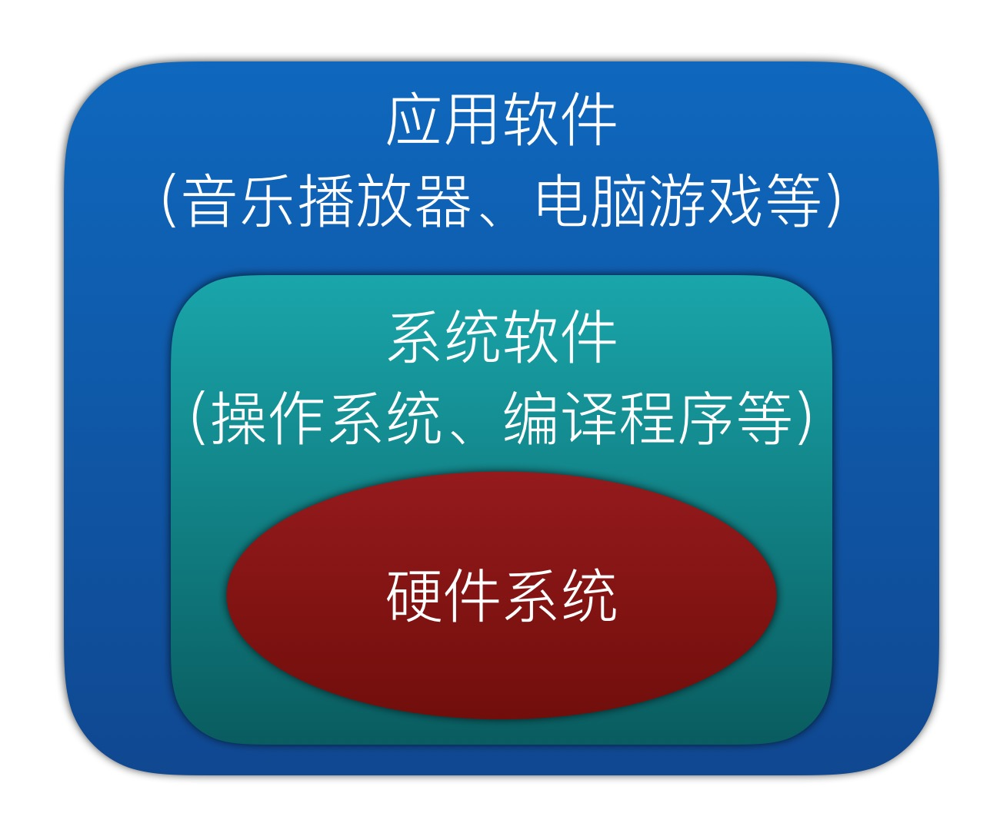

md:MarkDown格式的文件，作用是用来写笔记或者博客。

饮料有：

无序列表使用 加号 + 空格 的形式来表示。

+ 咖啡
+ 啤酒
+ 矿泉水
+ 白酒
+ 葡萄酒
+ 香槟酒

每天要做的事情:有序列表

1. 起床
2. 穿衣服
3. 一脸刷牙
4. 出门开车
5. 到公司上班

使用  # 表示标题

# 我是一级标题

## 我是二级标题

### 三级标题

#### 四级标题

###### 六级标题


我是一个**很帅很帅**的帅哥。

计算机（computer）俗称***电脑***，是现代一种用于*高速计算*的电子机器，可以进行数值计算，又可以进行逻辑判断，还具有存储记忆功能，且能够按照程序的运行，自动、高速处理数据。

> 我是一段文字说明。

[百度](https://www.baidu.com)



```python
print('hello world')
```

```c
int a = 100;
```

```javascript
document.write('hehe');
```

使用` *开始，*`结束，可以让字体倾斜。